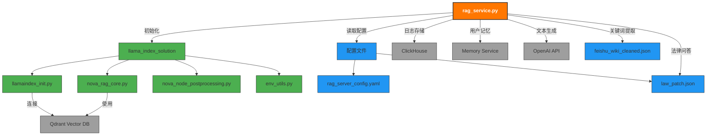
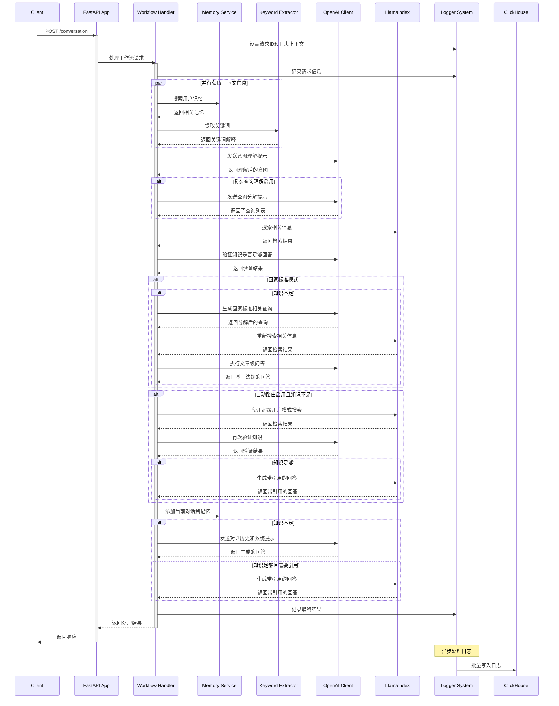
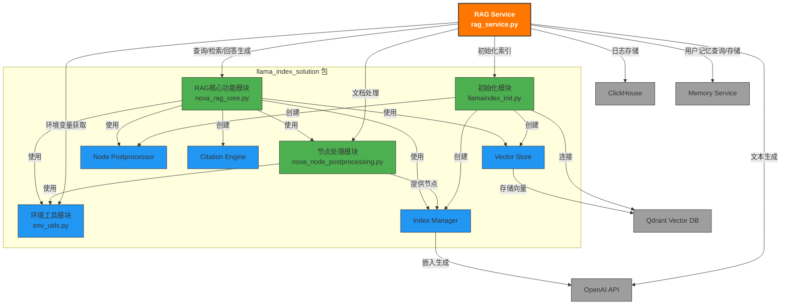

# Nova RAG 服务架构梳理

## 项目概述

Nova RAG 是一个基于检索增强生成技术的问答服务，主要用于处理用户查询并提供准确的回答。该服务利用向量检索和大语言模型，能够从知识库中检索相关信息并生成高质量的回答。

## 核心模块关系

通过对 `rag_service.py` 的代码分析，我们可以梳理出以下与服务运行相关的核心模块及其关系：

### 1. 入口服务模块

- **`coagent/entrypoints/v2/rag_service.py`**: 主服务入口，提供 FastAPI 接口和核心工作流逻辑

### 2. 检索引擎模块

- **`coagent/retrievers/llama_index_solution/`**: 提供向量检索和文档处理的核心功能
  - `llamaindex_init.py`: 初始化索引、向量存储和嵌入模型
  - `nova_rag_core.py`: 提供搜索、添加、更新、删除等核心功能
  - `nova_node_postprocessing.py`: 处理文档节点和后处理逻辑
  - `env_utils.py`: 环境变量工具

### 3. 配置模块

- **`coagent/configs/v2/`**: 存储服务配置
  - `rag_server_config.yaml`: 主要配置文件，包含 OpenAI、日志、向量存储等配置
  - `law_patch.json`: 法律/国家标准问答增强模式的配置

### 4. 工具模块

- **`coagent/entrypoints/v2/feishu_wiki_cleaned_20241120.json`**: 关键词提取和解释的数据源

## 模块依赖关系



## 服务功能与 API 端点

RAG 服务提供以下主要 API 端点：

1. **`/conversation`**: 主要工作流端点，处理对话请求
2. **`/add`**: 添加数据到索引
3. **`/search_by_doc_id`**: 通过文档 ID 搜索节点
4. **`/search_by_node_id`**: 通过节点 ID 搜索节点
5. **`/search_by_label`**: 通过标签搜索节点
6. **`/update`**: 更新索引中的数据
7. **`/query_search`**: 执行查询搜索
8. **`/citation_answer`**: 生成带引用的回答
9. **`/delete`**: 删除索引中的数据

## 工作流程概述

1. **请求接收**：接收包含对话历史和用户 ID 的请求
2. **意图理解**：使用 LLM 理解用户意图并生成搜索查询
3. **知识检索**：从向量存储中检索相关知识
4. **知识验证**：判断检索到的知识是否足够回答用户问题
5. **回答生成**：
   - 如果知识足够：生成带引用的回答
   - 如果知识不足：使用对话历史直接生成回答
6. **特殊模式处理**：
   - 国家标准模式：针对汽车行业标准的特殊处理
   - 自动路由模式：在知识不足时尝试超级用户模式
7. **记忆添加**：将当前对话添加到用户记忆中
8. **返回结果**：返回生成的回答和相关元数据

## 配置说明

服务配置主要通过 `rag_server_config.yaml` 文件提供，包括：

- OpenAI API 配置
- 日志配置
- 向量存储配置
- 对话历史长度配置
- 代理配置

## 启动服务

服务通过以下命令启动：

```bash
python coagent/entrypoints/v2/rag_service.py --config coagent/configs/v2/rag_server_config.yaml
```

## 注意事项

1. 服务依赖 Qdrant 向量数据库，需确保其正常运行
2. 需要配置正确的 OpenAI API 访问信息
3. 内存服务需要单独部署和配置
4. 日志存储使用 ClickHouse，需确保连接正常


# Nova RAG 服务代码结构与工作流程分析

## 代码结构概述

`rag_service.py` 是一个基于 FastAPI 的 RAG (Retrieval-Augmented Generation) 服务，主要用于处理对话请求，通过检索相关知识并结合 LLM 生成回答。该服务具有以下主要组件：

### 1. 核心组件

- **FastAPI 应用**: 提供 HTTP API 接口
- **日志系统**: 包含控制台、文件和 ClickHouse 异步日志处理
- **向量存储**: 使用 LlamaIndex 进行文档索引和检索
- **OpenAI 客户端**: 用于生成文本和理解用户意图
- **内存服务**: 用于存储和检索用户历史对话
- **关键词提取器**: 从用户输入中提取关键词并提供解释

### 2. 主要 API 端点

- `/conversation`: 主要工作流端点，处理对话请求
- `/add`: 添加数据到索引
- `/search_by_doc_id`: 通过文档 ID 搜索节点
- `/search_by_node_id`: 通过节点 ID 搜索节点
- `/search_by_label`: 通过标签搜索节点
- `/update`: 更新索引中的数据
- `/query_search`: 执行查询搜索
- `/citation_answer`: 生成带引用的回答
- `/delete`: 删除索引中的数据

### 3. 数据模型

使用 Pydantic 模型定义请求和响应结构，包括：
- `ConversationMessage`: 对话消息
- `WorkflowRequest`: 工作流请求
- `AddRequest`: 添加数据请求
- `SearchByDocIDRequest`: 通过文档 ID 搜索请求
- 等等

### 4. 辅助功能

- 法律/国家标准问答增强模式
- 复杂查询理解和分解
- 自动路由功能
- 记忆搜索和添加
- 维基搜索

## 外部依赖关系

该服务依赖于多个外部组件：

1. **LlamaIndex**: 用于文档索引和检索
   - 通过 `llama_index_init` 初始化索引和向量存储
   - 使用 `nova_rag_core` 中的函数进行搜索和操作

2. **OpenAI API**: 用于生成文本和理解用户意图
   - 使用 `AsyncOpenAI` 客户端进行异步调用
   - 支持聊天完成和工具调用

3. **内存服务**: 用于存储和检索用户历史对话
   - 通过 HTTP 请求与内存服务交互
   - 提供 `/search` 和 `/add` 端点

4. **ClickHouse**: 用于日志存储
   - 使用 `AsyncClickHouseHandler` 异步处理日志
   - 批量写入日志到 ClickHouse 数据库

5. **配置文件**: 通过 YAML 文件提供配置
   - 包含 OpenAI API、内存服务、日志等配置

## 工作流程

### 主要工作流程 (`/conversation` 端点)

1. **请求接收与预处理**:
   - 接收包含对话历史、工具和用户 ID 的请求
   - 设置请求 ID 和日志上下文
   - 提取最新的用户输入和对话历史

2. **意图理解**:
   - 并行获取用户记忆和维基解释
   - 使用 LLM 生成搜索查询，理解用户意图
   - 可选择进行复杂查询分解，生成多个子查询

3. **知识检索**:
   - 使用意图或子查询从索引中检索相关知识
   - 对检索结果进行格式化和后处理

4. **知识验证**:
   - 使用 LLM 判断检索到的知识是否足够回答用户问题
   - 如果不足够且启用了自动路由，尝试使用超级用户模式重新检索

5. **特殊模式处理**:
   - 如果是国家标准模式，进行特殊的法规查询和回答生成
   - 使用 `article_level_qa_async` 生成基于法规的回答

6. **回答生成**:
   - 如果知识不足，使用对话历史和系统提示直接生成回答
   - 如果知识足够，生成带引用的回答
   - 处理工具调用和普通回复

7. **记忆添加**:
   - 将当前对话添加到用户记忆中

8. **返回结果**:
   - 返回生成的回答和相关元数据

### 日志处理流程

1. **日志初始化**:
   - 设置控制台、文件和 ClickHouse 日志处理器
   - 配置日志格式和级别

2. **异步日志处理**:
   - 将日志条目添加到队列
   - 后台线程批量处理队列中的日志
   - 写入到 ClickHouse 数据库

3. **日志关闭**:
   - 在应用关闭时刷新剩余日志
   - 关闭日志处理器

### 应用生命周期管理

1. **启动**:
   - 初始化资源，包括日志系统
   - 设置 ClickHouse 日志处理器

2. **关闭**:
   - 释放资源
   - 关闭日志处理器

## UML 时序图



这个时序图展示了 RAG 服务处理对话请求的完整流程，包括并行获取上下文信息、意图理解、知识检索、验证和回答生成等步骤，以及特殊模式和自动路由的处理逻辑。


# RAG Service 与 llama_index_solution 的依赖关系分析

## RAG Service 与 llama_index_solution 的交互关系

RAG Service (`rag_service.py`) 是一个基于 FastAPI 的服务，它的核心功能依赖于 `llama_index_solution` 包提供的各种组件和功能。这种依赖关系主要体现在以下几个方面：

1. **索引初始化与管理**：
   - RAG Service 使用 `llama_index_init` 函数初始化向量索引和存储
   - 依赖 `QdrantVectorStore` 和 `VectorStoreIndex` 进行文档存储和检索

2. **文档处理与节点管理**：
   - 使用 `nova_document_postprocessing` 处理文档并创建节点
   - 通过 `add`、`update`、`delete_node_by_doc_id` 等函数管理索引中的文档

3. **查询与检索**：
   - 使用 `query_search` 和 `query_list_search` 执行向量检索
   - 通过 `search_node_by_doc_id`、`search_nodes_by_node_id` 等函数进行精确检索

4. **回答生成**：
   - 使用 `citation_answer` 生成带引用的回答
   - 依赖 `generate_markdown_response` 格式化回答

5. **后处理与过滤**：
   - 使用 `CustomizeNodePostprocessor` 进行节点重排序
   - 通过 `generate_user_access_filter` 实现访问控制

RAG Service 通过这些依赖关系，将用户请求转化为向量查询，检索相关知识，并生成回答，形成一个完整的检索增强生成系统。

## llama_index_solution 架构梳理

`llama_index_solution` 是一个基于 LlamaIndex 框架的定制化解决方案，主要包含以下几个核心模块：

1. **初始化模块 (llamaindex_init.py)**：
   - 负责初始化嵌入模型、LLM、向量存储和索引
   - 定义了自定义的节点后处理器 `CustomizeNodePostprocessor`

2. **节点处理模块 (nova_node_postprocessing.py)**：
   - 提供文档到节点的转换和处理功能
   - 实现了节点合并、分割和元数据处理

3. **核心RAG功能模块 (nova_rag_core.py)**：
   - 提供查询、检索、添加、更新和删除等核心功能
   - 实现了引用回答生成和Markdown处理

4. **环境工具模块 (env_utils.py)**：
   - 提供环境变量获取和处理功能

这些模块共同构成了一个完整的RAG解决方案，为RAG Service提供了必要的功能支持。

## 架构图



这个架构图展示了 `llama_index_solution` 包的内部结构以及与 RAG Service 的交互关系。RAG Service 作为一个独立模块，通过调用 `llama_index_solution` 包中的各种功能来实现检索增强生成。图中使用醒目的橙色标注了 RAG Service，并通过连接线展示了它与各个模块的依赖关系。

这个架构图与之前的时序图相互补充：时序图展示了请求处理的流程和时间顺序，而架构图则展示了系统的静态结构和组件关系。通过这两个图，我们可以全面理解 RAG Service 的工作原理和依赖关系。
